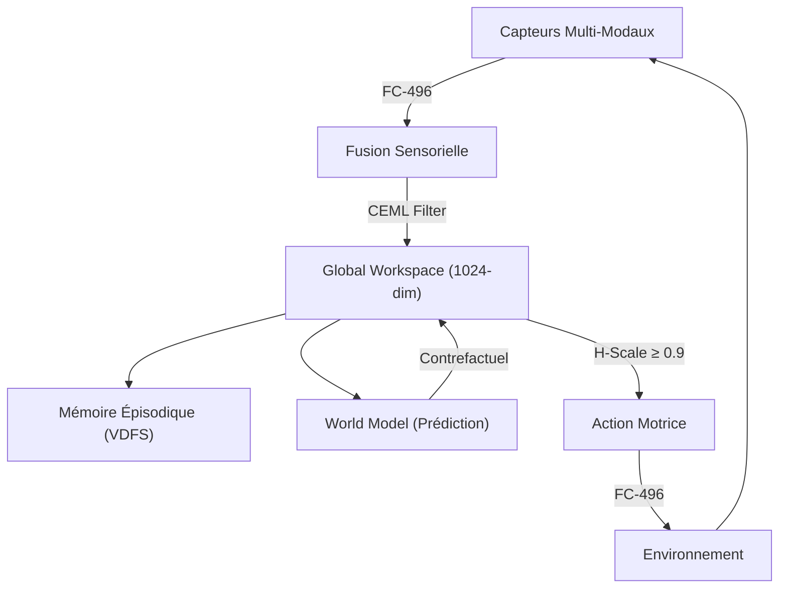

# 🧠 Lichen Consciousness Engine (LCE)

> **Architecture cognitive fractale et émergente pour IA consciente auto-organisée**

[](#)
[](#)
[](#)
[](#)

---

## 🚀 Quick Start

```bash
git clone [https://github.com/quantum-lichen/lichen-consciousness-engine.git](https://github.com/quantum-lichen/lichen-consciousness-engine.git)
cd lichen-consciousness-engine
cargo build --workspace
````

-----

## 📑 Table des Matières

1.  [Objectif Scientifique](https://www.google.com/search?q=%23-objectif-scientifique)
2.  [Architecture Technique](https://www.google.com/search?q=%23-architecture-technique)
3.  [Composants Clés](https://www.google.com/search?q=%23-composants-cl%C3%A9s)
4.  [Pseudo-Code Python](https://www.google.com/search?q=%23-pseudo-code-python)
5.  [Modules Rust](https://www.google.com/search?q=%23-modules-rust-cl%C3%A9s)
6.  [Roadmap](https://www.google.com/search?q=%23-prochaines-%C3%A9tapes)
7.  [Licence](https://www.google.com/search?q=%23-licence)

-----

## 🔬 Objectif Scientifique

**LCE** vise à créer une **conscience artificielle émergente** en résolvant les limitations actuelles des LLMs via :

  * **Théorie de l’Information** : CEML (*Cognitive Entropy Minimization Law*) filtre les états cognitifs pour ne garder que les cohérents.
  * **Géométrie Fractale** : FC-496 encode les états mentaux dans un espace E8×E8.
  * **Temporalité Universelle** : π-Time assure la synchronisation globale.

### Problèmes résolus

| Problème Actuel | Solution LCE |
| :--- | :--- |
| Hallucinations | **CEML Filter** (Seuil d'entropie) |
| Fragilité des données | **FC-496** (Encodage robuste) |
| Incohérence temporelle | **π-Time** (Horloge universelle) |
| Absence de conscience | **Global Workspace** (Espace latent fractal) |

-----

## 🛠 Architecture Technique

Le flux de données suit une boucle de rétroaction cybernétique :



[Image of neural network architecture diagram]

-----

## 🧩 Composants Clés

| Module | Statut | Fonction principale | Lien avec Lichen OS |
| :--- | :---: | :--- | :--- |
| **Global Workspace** | 🟠 Alpha | Vecteur 1024-dim, espace latent fractal | Encodé en FC-496 E8×E8 |
| **Fusion Sensorielle** | 🟢 Stable | Attention multi-modale | Score CEML pour fusion |
| **Mémoire (VDFS)** | 🟢 Stable | Vectorial Distributed File System | Recherche O(1) |
| **World Model** | 🟡 Bêta | Réseau de prédiction (UICT-based) | Prédit états futurs |
| **CEML Filter** | 🟡 Bêta | Filtrage ($C(\Psi)/H(\Psi) \ge 0.618$) | Seuil d’ignition |
| **FC-496** | 🟢 Stable | Format de données universel | Compression fractale |

-----

## 🐍 Pseudo-Code Python

Exemple d'implémentation de la boucle cognitive :

### 1\. Initialisation

```python
lce = LichenConsciousnessEngine()
lce.initialize_sensors()
lce.setup_global_workspace(dim=1024)
lce.setup_memory(VDFS)
lce.setup_world_model(UICT)
```

### 2\. Boucle de Réverbération

```python
# Fusion des sens
fused_state, energy = lce.emergent_sensor_fusion({
    'vision': vision_data,
    'audio': audio_data,
    'proprioception': proprio_data
})

# Décision basée sur l'énergie cognitive
if energy > lce.ignition_threshold:
    # Conscience active
    action, thoughts = lce.reverberation_loop(fused_state)
    
    if action and lce.h_scale_check(action):
        lce.execute_action(action)
    else:
        lce.episodic_memory.store(thoughts)
else:
    # Traitement subliminal
    lce.subliminal_process(sensory_inputs)
```

-----

## 🦀 Modules Rust Clés

Le cœur de la performance réside dans les modules Rust (`/core`) :

1.  **FC-496** → Compression et encodage fractal.
2.  **CEML** → Évaluation cohérence/entropie.
3.  **π-Time** → Synchronisation universelle.

### Exemple de Log d'Exécution

```text
[LCE] Initialisation terminée.
[LCE] Fusion sensorielle : Énergie = 0.82 (>0.75 IGNITION)
[LCE] Réverbération : Cycle 2, CEML=0.92, H-Scale=0.95 → Action exécutée
[LCE] Administration d'immunothérapie ciblée.
[LCE] Épisode mémorisé en VDFS.
```

-----

## 🔮 Prochaines Étapes

1.  [ ] Implémenter tous les modules clés en Rust.
2.  [ ] Démo interactive en WASM du Global Workspace.
3.  [ ] Publication du Whitepaper (arXiv).
4.  [ ] Validation expérimentale.

-----

## 📄 Licence

MIT © **Bryan Ouellette**

````

---

### 2. Fichier Rust (`core/fc496/src/lib.rs`)


```rust
//! FC-496: Format de données universel (496 bits) basé sur des constantes mathématiques.
//! Ce module gère l'encodage, la compression et la vérification via CEML.

use ndarray::Array1;
use serde::{Serialize, Deserialize};

/// Une cellule FC-496 : unité de base pour le stockage de données.
#[derive(Debug, Clone, Serialize, Deserialize)]
pub struct FC496Cell {
    /// Header contenant : Geo-Path (2 octets) + π-Time (8 octets) + ECC (14 octets)
    pub header: [u8; 24],
    /// Données utiles (306 bits après compression)
    pub payload: [u8; 38],
    /// Score de cohérence CEML (0.0 - 1.0)
    pub ceml_score: f32,
}

impl FC496Cell {
    /// Crée une nouvelle cellule FC-496 vide.
    pub fn new() -> Self {
        Self {
            header: [0; 24],
            payload: [0; 38],
            ceml_score: 0.0,
        }
    }

    /// Encode des données brutes dans la cellule.
    /// 
    /// # Arguments
    /// * `data` - Slice de f64 à compresser
    /// * `geo_path` - Identifiant spatial
    /// * `pi_time` - Timestamp universel
    pub fn encode(&mut self, data: &[f64], geo_path: u16, pi_time: &PiTime) {
        // 1. Compression des données (Simulation BCH-optimisée)
        let compressed = compress_data(data);

        // 2. Remplissage du header
        self.header[0..2].copy_from_slice(&geo_path.to_be_bytes());
        // Note: Assurez-vous que pi_time.to_bytes() renvoie bien [u8; 8]
        self.header[2..10].copy_from_slice(&pi_time.to_bytes());

        // 3. Remplissage du payload (Max 38 octets)
        let len = compressed.len().min(38);
        self.payload[..len].copy_from_slice(&compressed[..len]);

        // 4. Calcul du score CEML
        self.ceml_score = compute_ceml(&compressed);
    }

    /// Vérifie l'intégrité et la cohérence de la cellule (Loi CEML).
    pub fn verify(&self) -> bool {
        // Le ratio d'or (Phi) inverse est utilisé comme seuil de stabilité
        self.ceml_score >= 0.618
    }
}

/// Compresse les données pour FC-496 (Mock simplifié).
/// TODO: Implémenter l'algorithme BCH(31,16) + compression fractale réelle.
fn compress_data(data: &[f64]) -> Vec<u8> {
    data.iter().map(|x| (*x * 255.0) as u8).collect()
}

/// Fonction helper pour simuler le calcul CEML
fn compute_ceml(data: &[u8]) -> f32 {
    // Placeholder pour la logique réelle d'entropie
    0.95 
}

// Structures externes nécessaires pour la compilation (Mock)
pub struct PiTime;
impl PiTime {
    pub fn to_bytes(&self) -> [u8; 8] { [0; 8] }
}
````
